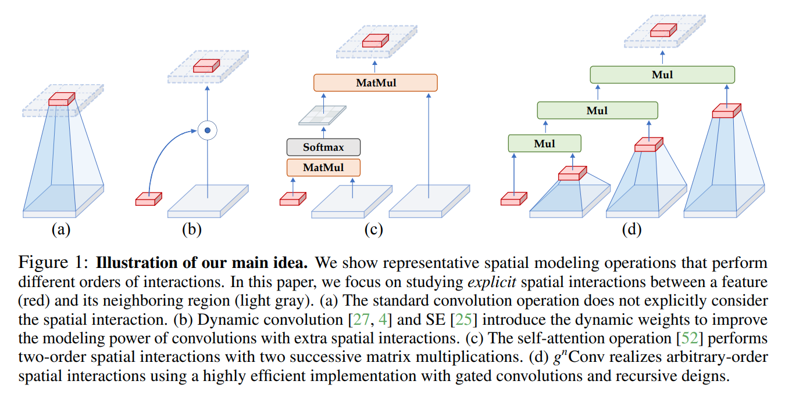

# HorNet-Toy-Implementation
A personal and simple toy implementation of the paper "HorNet: Efficient High-Order Spatial Interactions with Recursive Gated Convolutions"

[[Link to the Paper](https://arxiv.org/pdf/2207.14284.pdf)]

[[Link to the GitHub's Official Page of the Project](https://github.com/raoyongming/HorNet)]

## The Idea

[Here](https://www.linkedin.com/posts/diego-bonilla-salvador_hornet-efficient-high-order-spatial-interactions-activity-6967046915418935296-uli6?utm_source=linkedin_share&utm_medium=member_desktop_web) I shared a highlighted version of the paper to ease the reading.

## Training
The training is pretty straightforward and has nothing in special. The models are from the official repo and the dataset I've used is the [Flowers102](https://www.kaggle.com/competitions/oxford-102-flower-pytorch).

## Results
The model trained for ___ epochs (until the early stop condition was true), and performed an outstanding __% accuracy on test data.
